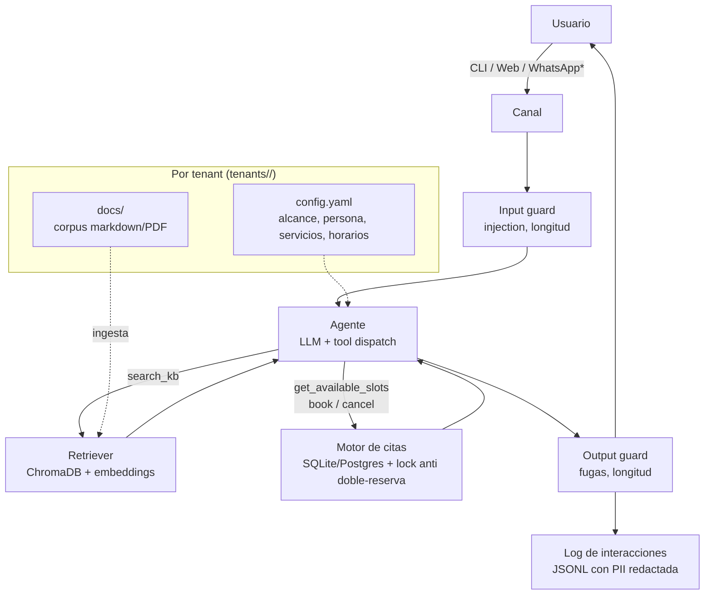

# Chatbot multi-tenant: RAG + agendamiento de citas

Chatbot **reutilizable por sector/empresa**: responde preguntas sobre una base de
conocimiento intercambiable (RAG) y gestiona agendas para planificar, consultar y
cancelar citas. Montar la solución para una nueva empresa = crear una carpeta de
configuración y documentos; **el código no se toca**.

El MVP corre 100% local con [Ollama](https://ollama.com) (LLM y embeddings). El paso a
un modelo cloud (Anthropic, OpenAI, etc.) para producción en web o WhatsApp es un cambio
de variables de entorno, no de código.

## Arquitectura

Agente único con herramientas (tool calling) + RAG. La decisión está justificada en
[docs/adr/0001](docs/adr/0001-agente-unico-con-tools.md): para un chatbot conversacional,
los sistemas multiagente multiplican el costo en tokens (4-220x según estudios de 2026)
sin mejorar la calidad.



\* WhatsApp es una fase futura; el diseño de canales como adaptadores ya lo contempla.

**Núcleo vs aplicación** (`src/`):

- `chatbot_core/` — reutilizable y agnóstico al dominio: agente, tools, RAG, motor de
  citas, guards, observabilidad. Todo lo intercambiable (LLM, vector store, embeddings,
  calendario) está detrás de `typing.Protocol`.
- `chatbot_app/` — wiring concreto: bootstrap, prompt del sistema, CLI y API web.
- `tenants/<empresa>/` — lo específico de cada cliente: configuración y corpus.

## Requisitos

- Python 3.12 (lo gestiona [uv](https://docs.astral.sh/uv/) automáticamente)
- [Ollama](https://ollama.com) corriendo localmente (MVP)
- ~6 GB de VRAM libres para `llama3.1:8b` + `bge-m3`

## Puesta en marcha (MVP local)

```bash
# 1. Modelos locales
ollama pull llama3.1:8b     # LLM con tool calling
ollama pull bge-m3          # embeddings multilingües

# 2. Dependencias
uv sync

# 3. Indexar el corpus del tenant demo (clínica dental)
uv run chatbot ingest

# 4a. Chat en terminal
uv run chatbot chat

# 4b. …o canal web con widget en http://localhost:8000
uv run uvicorn chatbot_app.main:app
```

## Montar la solución para una nueva empresa

1. Copia `tenants/demo_clinica/` a `tenants/<mi_empresa>/`.
2. Edita `config.yaml`: nombre, sector, alcance temático, respuesta fuera de alcance,
   servicios, horarios y zona horaria.
3. Reemplaza los documentos de `docs/` (markdown, txt o PDF) con la información real.
4. Apunta la instalación al tenant y reindexa:

```bash
# .env
CHATBOT_TENANT=mi_empresa
```

```bash
uv run chatbot ingest
```

## Cambiar el modelo (local ⇄ cloud)

Todo pasa por [LiteLLM](https://docs.litellm.ai): el identificador de modelo decide el
provider. En `.env` (ver [.env.example](.env.example)):

```bash
# Local (MVP)
CHATBOT_LLM_MODEL=ollama/llama3.1:8b
CHATBOT_LLM_API_BASE=http://localhost:11434

# Cloud (producción) — requiere la API key del provider en el entorno
CHATBOT_LLM_MODEL=anthropic/claude-haiku-4-5-20251001
CHATBOT_LLM_API_BASE=
```

Antes de promover un cambio de modelo, valida con la suite de tests y una conversación
de prueba end-to-end (pregunta del corpus, pregunta fuera de alcance, reserva de cita).

## Desarrollo

```bash
uv run pytest            # tests (rápidos, sin red: FakeLLM/FakeEmbedder)
uv run pytest -m slow    # integración con Ollama real (requiere Ollama activo)
uv run ruff check src tests && uv run ruff format --check src tests
uv run mypy src
```

Decisiones de arquitectura documentadas en [docs/adr/](docs/adr/).

## Limitaciones actuales (honestas)

- **Sesiones en memoria**: el historial de conversación se pierde al reiniciar el
  proceso (suficiente para MVP single-process; Redis/DB al escalar).
- **Un recurso por tenant**: el motor de citas asume una sola agenda (no hay múltiples
  profesionales en paralelo todavía).
- **Guards heurísticos**: la defensa contra prompt injection es por patrones + reglas
  de prompt; un modelo pequeño local sigue siendo más manipulable que uno cloud.
- **Sin sincronización real con Google Calendar**: el contrato (`CalendarSync`) existe,
  la implementación es una fase futura.
- **WhatsApp**: pendiente; requiere Meta Cloud API/BSP y plantillas aprobadas, y desde
  enero 2026 Meta solo permite agentes de propósito específico (este bot califica:
  soporte acotado + citas).
