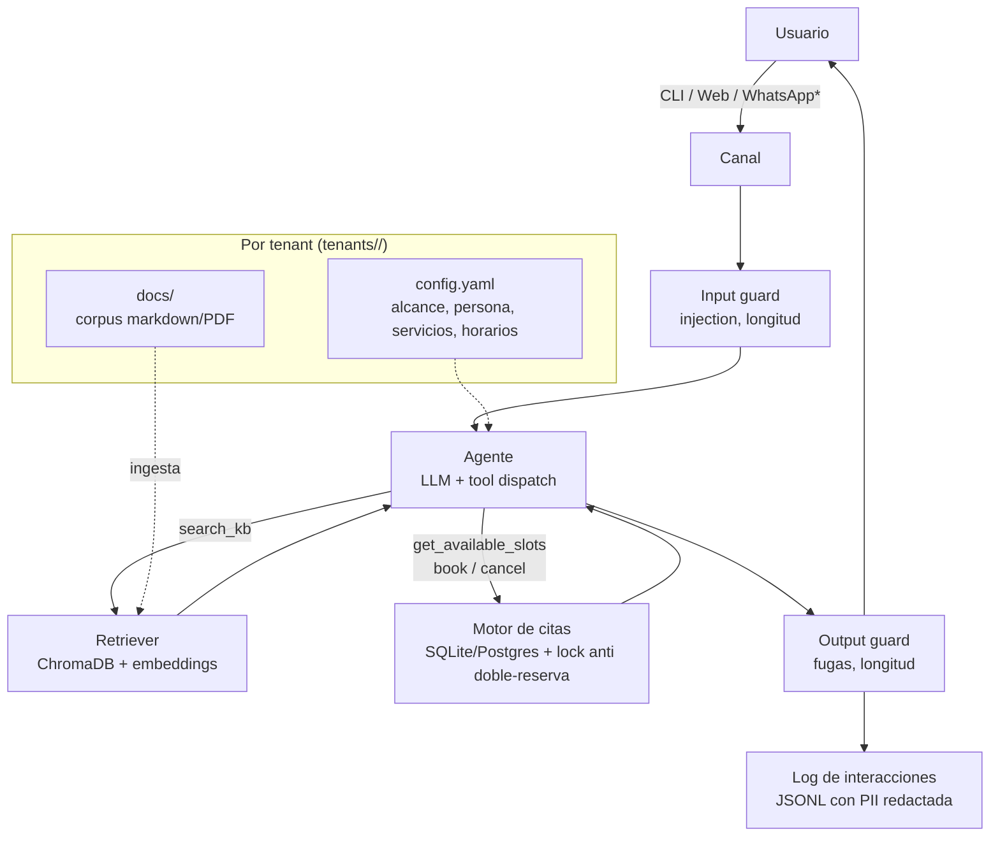

# Chatbot multi-tenant: RAG + agendamiento de citas

Chatbot **reutilizable por sector/empresa**: responde preguntas sobre una base de
conocimiento intercambiable (RAG) y gestiona agendas para planificar, consultar y
cancelar citas. Montar la solución para una nueva empresa = crear una carpeta de
configuración y documentos; **el código no se toca**.

El MVP corre 100% local con [Ollama](https://ollama.com) (LLM y embeddings). El paso a
un modelo cloud (Anthropic, OpenAI, etc.) para producción en web o WhatsApp es un cambio
de variables de entorno, no de código.

## Estado actual (julio 2026)

| Componente | Estado |
|---|---|
| Núcleo reutilizable (RAG, agente, citas, guards, observabilidad) | ✅ Implementado |
| Canal CLI (chat en terminal) | ✅ Funcional |
| Canal web (FastAPI + widget JS) | ✅ Funcional |
| Tenant demo `demo_clinica` | ✅ Corpus indexado, citas configuradas |
| 52 tests unitarios (FakeLLM, sin red) | ✅ Todos en verde |
| Verificación e2e con Ollama real (`qwen3:8b`) | ✅ RAG + tool calling validado |
| Swap local → cloud (LiteLLM) | ✅ Solo cambio de `.env` |
| Multi-tenant por configuración | ✅ Añadir empresa = copiar carpeta + ingest |
| Sync Google Calendar | 🔲 Contrato definido, implementación pendiente |
| Canal WhatsApp | 🔲 Diseño preparado, requiere Meta API/BSP |
| Sesiones persistentes (Redis/DB) | 🔲 Actualmente en memoria |
| Dockerfile / deploy cloud | 🔲 Siguiente fase |

## Arquitectura

Agente único con herramientas (tool calling) + RAG. La decisión está justificada en
[docs/adr/0001](docs/adr/0001-agente-unico-con-tools.md): para un chatbot conversacional,
los sistemas multiagente multiplican el costo en tokens (4-220x según estudios de 2026)
sin mejorar la calidad.



\* WhatsApp es una fase futura; el diseño de canales como adaptadores ya lo contempla.

**Núcleo vs aplicación** (`src/`):

- `chatbot_core/` — reutilizable y agnóstico al dominio: agente, tools, RAG, motor de
  citas, guards, observabilidad. Todo lo intercambiable (LLM, vector store, embeddings,
  calendario) está detrás de `typing.Protocol`.
- `chatbot_app/` — wiring concreto: bootstrap, prompt del sistema, CLI y API web.
- `tenants/<empresa>/` — lo específico de cada cliente: configuración y corpus.

## Requisitos

- Python 3.12 (lo gestiona [uv](https://docs.astral.sh/uv/) automáticamente)
- [Ollama](https://ollama.com) corriendo localmente (MVP)
- GPU con 8-12 GB VRAM recomendada; CPU funciona pero con latencia alta

## Puesta en marcha (MVP local)

```bash
# 1. Modelos locales (solo la primera vez)
ollama pull qwen3:8b    # LLM principal — mejor tool calling que llama3.1:8b
ollama pull bge-m3      # embeddings multilingües (español incluido)

# 2. Dependencias Python
uv sync

# 3. Copiar configuración de entorno
cp .env.example .env    # revisar y ajustar si hace falta

# 4. Indexar el corpus del tenant demo (clínica dental)
uv run chatbot ingest

# 5a. Chat en terminal
uv run chatbot chat

# 5b. …o canal web con widget en http://localhost:8000
uv run uvicorn chatbot_app.main:app --reload
```

## Montar la solución para una nueva empresa

1. Copia `tenants/demo_clinica/` a `tenants/<mi_empresa>/`.
2. Edita `config.yaml`: nombre, sector, alcance temático, respuesta fuera de alcance,
   servicios, horarios y zona horaria.
3. Reemplaza los documentos de `docs/` (markdown, txt o PDF) con la información real.
4. Apunta la instalación al nuevo tenant y reindexa:

```bash
# en .env
CHATBOT_TENANT=mi_empresa
```

```bash
uv run chatbot ingest
```

Listo. No se toca ningún archivo de código.

## Cambiar el modelo (local ⇄ cloud)

Todo pasa por [LiteLLM](https://docs.litellm.ai): el identificador de modelo decide el
provider. En `.env` (ver [.env.example](.env.example)):

```bash
# Local (MVP) — recomendado por mejor tool calling:
CHATBOT_LLM_MODEL=ollama/qwen3:8b
CHATBOT_LLM_API_BASE=http://localhost:11434

# Cloud (producción web) — requiere la API key del provider:
CHATBOT_LLM_MODEL=anthropic/claude-haiku-4-5-20251001
CHATBOT_LLM_API_BASE=
# ANTHROPIC_API_KEY=sk-ant-...

# Cloud alternativo:
# CHATBOT_LLM_MODEL=openai/gpt-4.1-mini
# OPENAI_API_KEY=sk-...
```

**Antes de promover un cambio de modelo**, valida con el script de evaluación:

```bash
uv run python scripts/evaluate.py
```

## Desarrollo

```bash
uv run pytest                                        # tests rápidos (FakeLLM, sin red)
uv run pytest -m slow                               # integración con Ollama real
uv run ruff check src tests && uv run ruff format --check src tests
uv run mypy src
```

Decisiones de arquitectura documentadas en [docs/adr/](docs/adr/).

## Limitaciones actuales

- **Sesiones en memoria**: el historial de conversación se pierde al reiniciar el
  proceso. Suficiente para MVP single-process; se añade Redis o DB en producción.
- **Un recurso por tenant**: el motor de citas asume una sola agenda por empresa
  (sin soporte de múltiples profesionales en paralelo todavía).
- **Scope enforcement por prompt**: la restricción de temas depende de que el LLM
  siga las instrucciones del system prompt. Los modelos de 8B lo hacen de forma menos
  fiable que los modelos cloud — comportamiento mejorable con un clasificador de
  intención explícito como segunda capa.
- **Sin sincronización real con Google Calendar**: el contrato (`CalendarSync`) está
  definido; la implementación es una fase futura.
- **WhatsApp pendiente**: requiere Meta Cloud API o un BSP (Twilio / 360dialog),
  plantillas aprobadas y cumplir la política 2026 de Meta (solo agentes task-specific;
  este bot califica: soporte acotado + citas).
